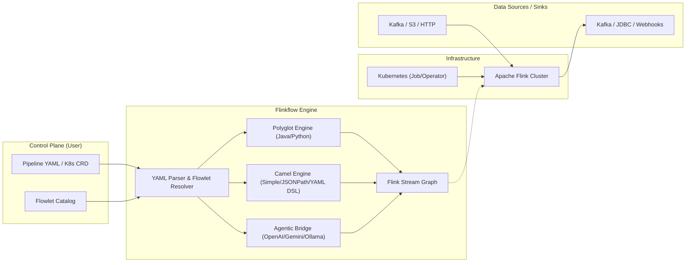

# Flinkflow


**Flinkflow** is a declarative, low-code data streaming platform built natively for **Apache Flink 2.2.0**. Inspired by Apache Camel K, it democratizes stateful stream processing by abstracting the complexities of the modern Flink DataStream V2 API into a simple, Kubernetes-native YAML DSL.

---
**[🌐 Documentation](https://talweg.ai)** | **[🚀 Get Started](https://talweg.ai/docs/)** | **[🏗️ Architecture](https://talweg.ai/docs/01_ARCHITECTURE)**

---

## 🚀 The Philosophy: Democratizing Data Engineering

Traditionally, building real-time data pipelines is a specialized engineering endeavor, requiring deep Java/Scala expertise and resulting in siloed data teams. Flinkflow breaks down this "Flink Complexity Gap" by shifting the focus from **infrastructure plumbing** to **data logic**.

Our mission is to be the **"Glue Layer"** for real-time event-driven architectures—empowering Data Analysts, DevOps, and Backend Developers to build, deploy, and scale enterprise-grade streaming workloads without ever touching a Maven assembly.

### Why Flinkflow?

| Feature | Native Java Flink | Flinkflow |
| :--- | :--- | :--- |
| **Authoring** | Heavy Java/Maven Boilerplate | Declarative YAML DSL |
| **Development Cycle** | Compile → Package → Deploy JAR | Instant Hot-Reload (YAML/Java/Python/Camel Snippets) |
| **Logic Changes** | ~10 minute CI/CD cycles | Seconds (Apply K8s CRD or YAML) |
| **Polyglot Runtimes** | Java Only | **Java** (Janino), **Python** (GraalVM), **Apache Camel** (Simple/JsonPath/YAML DSL) |
| **Target Persona** | Specialized Flink Engineers | Data Scientists, Analysts, DevOps, Integration Devs |
| **Component Model** | Custom Code / Classes | Reusable, Parameterized **Flowlets** |

---

## 👥 Designed for Every Data Persona

Flinkflow bridges the gap between high-performance data engineering and the broader developer ecosystem, empowering a diverse set of stakeholders:

- **🐍 Data Scientists & Analysts**: Port existing Python logic, complex JSON parsing, and feature-engineering snippets directly into production using the secure **GraalVM Python** runtime.
- **🐫 Low-Code & Integration Developers**: Build entire pipelines using **Apache Camel DSL**, **JsonPath**, and **Simple** expressions. Ideal for declarative transformations, filters, and field extractions without writing procedural code.
  - *Ref: [Apache Camel](https://camel.apache.org/), [Simple Language](https://camel.apache.org/components/latest/languages/simple-language.html), [YAML DSL](https://camel.apache.org/manual/camel-yaml-dsl.html)*
- **☸️ DevOps & Platform Engineers**: Manage high-throughput streaming as native Kubernetes **Pipeline CRDs**. No specialized JAR deployments or Maven assemblies—just pure GitOps via YAML.
- **💻 Backend & Fullstack Developers**: Rapidly build stateful filters, enrichments, and multi-stream joins using a declarative DSL instead of mastering the Flink DataStream API.
- **🏢 Enterprise Platforms**: Securely democratize streaming across teams. The **Zero-Trust Polyglot Sandbox** ensures that guest code (Java/Python) remains fully isolated and safe.
- **🤖 GenAI & Agentic AI**: Flinkflow is a **Declarative Agentic Platform**. Beyond simple "Chat-to-Pipeline" generation, it now supports native autonomous agents. These agents can reason over data streams, maintain stateful memory, and call your Flowlets as tools to take real-world actions.

---

## ✨ Features

- **Declarative YAML DSL**: Define entire pipeline structures—Sources, Sinks, and Operations—in clean YAML.
- **Polyglot Logic Snippets**: Inject custom logic directly into your YAML—support for **Java (Janino)**, **Python (GraalVM)**, and **Apache Camel (Simple/JsonPath/Groovy)** for transformations, filters, and flatmaps.
- **Kubernetes-Native (GitOps)**: Manage pipelines as `Pipeline` and `Flowlet` Custom Resources. Fully compatible with Helm, ArgoCD, and the Flink Kubernetes Operator. See [docs/07_DEPLOY_K8S.md](docs/07_DEPLOY_K8S.md).
- **Reusable Flowlet Catalog**: Drag-and-drop capability for complex connectors (Kafka, Confluent, S3, JDBC) using parameterized components.
- **Advanced Data Mapping**: Support for XSLT 3.0 via Saxon-HE for structural JSON/XML transformations (Kaoto integration). See [docs/06_GUIDE_DATAMAPPER.md](docs/06_GUIDE_DATAMAPPER.md).
- **Observability Built-in**: Real-time monitoring of job health and throughput via a dedicated dashboard.
- **Extensible Connectors**: Unified support for Kafka, S3, JDBC, HTTP Sinks, and more.
- **Agentic Bridge (Flink 2.2+)**: Run autonomous AI agents directly in your stream. Support for **OpenAI** (GPT-4o), **Google Gemini**, and **Ollama**. Powered by **Flink State V2**, providing non-blocking, asynchronous memory for conversation history and reasoning.
- **Asynchronous State Processing**: Native support for Flink's State V2 APIs in all Agentic steps, ensuring high throughput even with large state sizes or remote backends.
- **Apache Camel Integration**: Use Camel **Simple**, **JSONPath**, and **YAML DSL** for expressive, low-code transformations — no Java required.
- **Enterprise Security**: Native support for Kubernetes Secrets (`secret:name/key`) to secure credentials without hardcoding.
- **Schema Management**: First-class integration with Confluent/Apicurio Schema Registry for Avro-encoded streams with automatic schema fetching.


---

## 📖 Documentation Roadmap

To explore Flinkflow in detail, refer to the specialized documentation for each component:

*   **[Kubernetes Deployment Guide](docs/07_DEPLOY_K8S.md)**: authoritive guide for running Flinkflow via the Flink Kubernetes Operator.
*   **[Pipeline Configuration Reference](docs/04_GUIDE_CONFIGURATION.md)**: Comprehensive guide for the YAML DSL, connectors, and secret management.
*   **[Operations & Monitoring](docs/05_GUIDE_OPERATIONS.md)**: Details on performance, dashboard setup, and troubleshooting.
*   **[Infrastructure Catalog (deploy/k8s/)](deploy/k8s/README.md)**: Reference for manifests, RBAC, and system deployments.
*   **[Flowlet Registry (deploy/k8s/flowlets/)](deploy/k8s/flowlets/README.md)**: Library of reusable, parameterized pipeline components.
*   **[XSLT DataMapper Guide](docs/06_GUIDE_DATAMAPPER.md)**: Deep dive into using Saxon-HE for structural mapping.
*   **[System Architecture](docs/01_ARCHITECTURE.md)**: Detailed diagrams and component descriptions.
*   **[ADR-005: Agentic Bridge](adr/005_AGENTIC_BRIDGE.md)**: Conceptual design for autonomous AI agents on Flink.
*   **[Project Roadmap](docs/08_VISION.md)**: Future milestones and planned features.


---

## 🗺️ Visual Overview

Flinkflow bridges the gap between declarative configuration and high-performance execution.



---

## 🤖 Democratizing Data with GenAI

Flinkflow's YAML-first approach is specifically designed to be **LLM-optimized**. While traditional Flink Java code is verbose and prone to hallucination errors in logic flow, Flinkflow's declarative DSL provides a constrained, structured schema that GenAI models can generate with high precision.

*   **Chat-to-Pipeline**: Build complex real-time filters, enrichments, and aggregations using natural language.
*   **Predictable Output**: The YAML schema ensures that generated pipelines are syntactically valid and architecturally consistent.
*   **Encapsulated Logic**: Janino (Java), GraalVM (Python), and Apache Camel (Simple/JSONPath/YAML DSL) snippets allow for precise "injection" of custom business logic without breaking the high-level pipeline structure.

---


## ⚡ Performance: Polyglot-AOT Architecture
Flinkflow achieves native-level performance through its **Janino-powered** (Java), **GraalVM-powered** (Python), and **Camel-powered** (Simple/JSONPath/YAML DSL) code injection system. All logic snippets in your YAML are compiled/optimized **exactly once** during job startup, resulting in zero overhead during high-throughput record processing.
> See **[Operations & Performance (docs/05_GUIDE_OPERATIONS.md)](docs/05_GUIDE_OPERATIONS.md)** for details.

---

## 📂 Project Structure

To explore the Flinkflow codebase and directory layout, see the **[Developer Guide (docs/03_DEVELOPER_GUIDE.md)](docs/03_DEVELOPER_GUIDE.md)**.


### Docker Deployment

#### Pre-built Images (GHCR)

You can pull the official pre-built Docker image from the GitHub Container Registry. Images are tagged using semantic versioning and the commit SHA.

```bash
docker pull ghcr.io/talwegai/flinkflow:0.9.3{version}
```


## ☸️ Kubernetes Deployment

For enterprise-grade deployments, Flinkflow is designed to be **Kubernetes-native**.


### 🏆 Recommended: Kubernetes-Native Pipeline (CRD Based)

For the best developer experience, Flinkflow allows you to define your entire job configuration as a **Pipeline** custom resource. This enables GitOps-driven streaming without managing local YAML files or ConfigMaps.

> [!IMPORTANT]
> **Prerequisites for CRD-Based Mode**:
> 1.  **Install the CRDs**: (`deploy/k8s/crds/crd-pipeline.yaml`, `deploy/k8s/crds/crd-flowlet.yaml`) 
> 2.  **Configure RBAC**: (`deploy/k8s/rbac.yaml`) This grants the Flink pods permission to query the Kubernetes API for your pipeline definitions at startup.
> 
> *Note: The Flink Kubernetes Operator is **not** a prerequisite for using the Pipeline CRD, though it is recommended for production lifecycle management.*

1.  **Install System Resources**:
    ```bash
    # Install CRDs and configure cluster permissions
    kubectl apply -f deploy/k8s/crds/crd-pipeline.yaml
    kubectl apply -f deploy/k8s/crds/crd-flowlet.yaml
    kubectl apply -f deploy/k8s/rbac.yaml
    ```

2.  **Define your Pipeline**:
```yaml
# my-pipeline.yaml
apiVersion: flinkflow.io/v1alpha1
kind: Pipeline
metadata:
  name: enrichment-job
spec:
  parallelism: 2
  steps:
    - type: source
      name: static-source
      properties:
        content: "user-123|user-456"

    - type: process
      name: enrich-with-python
      language: python
      code: |
        # Native Python logic via GraalVM
        return f"enriched-{input}"

    - type: sink
      name: console-sink
```

### Deploy in 2 steps:
```bash
# 1. Apply the Pipeline resource
kubectl apply -f my-pipeline.yaml

# 2. Start the Flinkflow cluster (it will auto-fetch the Pipeline CR)
kubectl apply -f deploy/k8s/native-pipeline-deployment.yaml
```
    (Note: Edit `deploy/k8s/native-pipeline-deployment.yaml` to point at your pipeline's name).


4. **Delete the Cluster**:
   ```bash
   kubectl delete deployment flinkflow-native-cluster
   ```

### 📦 Alternative Kubernetes Methods

For traditional deployments or manual infrastructure control:
- **Flink Kubernetes Operator**: Standard `FlinkDeployment` manifests.
- **Manual Cluster Mode**: Direct JobManager/TaskManager Pod pool.
- **Native Submission**: Direct `flink run-application` via the K8s API.

> Detailed guides for these methods are available in the **[Kubernetes Deployment Guide (docs/07_DEPLOY_K8S.md)](docs/07_DEPLOY_K8S.md)**.


---

## 🛠️ Configuration & Secret Management

Flinkflow is configured via a high-level YAML DSL. You can define sources, sinks, and complex processing logic without writing a single line of Flink Java boilerplate.

> [!IMPORTANT]
> For the full specification of all connectors (Kafka, S3, JDBC, HTTP), operations (Windowing, Joins, Aggregations), and Secret Management (`secret:name/key`), refer to the **[Pipeline Configuration Reference (docs/04_GUIDE_CONFIGURATION.md)](docs/04_GUIDE_CONFIGURATION.md)**.


## 🏗️ Reusable Components: Flowlets

Flowlets are parameterized, shareable pipeline components. This allows you to define complex patterns (like "Confluent Kafka to S3") once and reuse them across dozens of pipelines by just changing parameters in the `with:` block.

> See **[Flowlet Catalog Index (deploy/k8s/flowlets/README.md)](deploy/k8s/flowlets/README.md)** and the **[Configuration Guide](docs/04_GUIDE_CONFIGURATION.md#flowlets)**.

---

## 📊 Monitoring

The **NiceGUI-based dashboard** provides real-time visibility into your Flink metrics and Kubernetes logs.

> See **[Operations & Monitoring (docs/05_GUIDE_OPERATIONS.md)](docs/05_GUIDE_OPERATIONS.md)**.

---

## 💡 Examples Catalog

*   **[Standalone Pipelines](examples/standalone/README.md)**: Explore joins, windowing, JDBC, and more.
*   **[Kubernetes CRDs](examples/k8s/README.md)**: Ready-to-apply `Pipeline` resources.

---

## 🔒 Security: Polyglot Sandboxing

Flinkflow implements a strict, **deny-by-default** security model for guest code execution. It uses a hardened **GraalVM Python sandbox** and restricted **Janino Java** runtime to protect the Flink cluster from potential exploits within user-supplied YAML logic.

> [!TIP]
> This security architecture makes Flinkflow uniquely suited for **LLM-generated pipelines** and **Multi-Tenant environments**. Detailed technical specs on the sandbox isolation can be found in our **[Security Policy (docs/09_SECURITY.md)](docs/09_SECURITY.md)**.

> [!IMPORTANT]
> This security architecture makes Flinkflow uniquely suited for **LLM-generated pipelines** and **Multi-Tenant environments**, where safety and isolation are paramount.

## 🏢 Flinkflow Enterprise Edition & Services

Flinkflow is maintained by **[Talweg](https://talweg.ai)**. While the core engine is free and open-source, we offer professional services and an enterprise-grade distribution for organization-wide streaming platforms.


**Need help or looking for enterprise features?** [Contact our team](mailto:contact@talweg.ai) or visit **[talweg.ai](https://talweg.ai)**.

---

## 📄 License

Flinkflow is licensed under the **Apache License, Version 2.0**. See the [LICENSE](LICENSE) file for the full license text.

---

## 🤝 Community & Contributing

Flinkflow is an open-source project and we welcome contributions of all kinds! Whether you are fixing a bug, improving the docs, or suggesting a new feature, your help is appreciated.

*   **[Contributing Guide](docs/community/CONTRIBUTING.md)**: For finding bugs and submitting features.
*   **[Developer Guide](docs/03_DEVELOPER_GUIDE.md)**: For deep-dive engine development and internals.
*   **[Code of Conduct](docs/community/CODE_OF_CONDUCT.md)**: Our standards for a welcoming community.
*   **[Security Policy](docs/09_SECURITY.md)**: How to report vulnerabilities and our support model.
*   **[Report an Issue](https://github.com/talwegai/flinkflow/issues)**: Help us make Flinkflow better by reporting bugs.

---

*Democratizing stateful stream processing for the modern data stack.*
