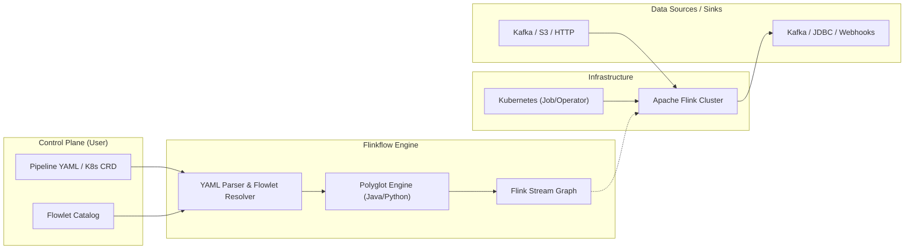

# Flinkflow

**Flinkflow** is a declarative, low-code data streaming platform built on top of Apache Flink. Inspired by Apache Camel K, it democratizes stateful stream processing by abstracting the complexities of the Flink API into a simple, Kubernetes-native YAML DSL.

---
**[🌐 Documentation](https://talweg.ai)** | **[🚀 Get Started](https://talweg.ai/docs/)** | **[🏗️ Architecture](https://talweg.ai/docs/ARCHITECTURE)**

---

## 🚀 The Philosophy: Democratizing Data Engineering

Traditionally, building real-time data pipelines is a specialized engineering endeavor, requiring deep Java/Scala expertise and resulting in siloed data teams. Flinkflow breaks down this "Flink Complexity Gap" by shifting the focus from **infrastructure plumbing** to **data logic**.

Our mission is to be the **"Glue Layer"** for real-time event-driven architectures—empowering Data Analysts, DevOps, and Backend Developers to build, deploy, and scale enterprise-grade streaming workloads without ever touching a Maven assembly.

### Why Flinkflow?

| Feature | Native Java Flink | Flinkflow |
| :--- | :--- | :--- |
| **Authoring** | Heavy Java/Maven Boilerplate | Declarative YAML DSL |
| **Development Cycle** | Compile → Package → Deploy JAR | Instant Hot-Reload (YAML/Java/Python Snippets) |
| **Logic Changes** | ~10 minute CI/CD cycles | Seconds (Apply K8s CRD or YAML) |
| **Target Persona** | Specialized Flink Engineers | Data Scientists, Analysts, DevOps, Backend Devs |
| **Component Model** | Custom Code / Classes | Reusable, Parameterized **Flowlets** |

---

## 👥 Designed for Every Data Persona

Flinkflow bridges the gap between high-performance data engineering and the broader developer ecosystem, empowering a diverse set of stakeholders:

- **🐍 Data Scientists & Analysts**: Port existing Python logic, complex JSON parsing, and feature-engineering snippets directly into production using the secure **GraalVM Python** runtime.
- **☸️ DevOps & Platform Engineers**: Manage high-throughput streaming as native Kubernetes **Pipeline CRDs**. No specialized JAR deployments or Maven assemblies—just pure GitOps via YAML.
- **💻 Backend & Fullstack Developers**: Rapidly build stateful filters, enrichments, and multi-stream joins using a declarative DSL instead of mastering the Flink DataStream API.
- **🏢 Enterprise Platforms**: Securely democratize streaming across teams. The **Zero-Trust Polyglot Sandbox** ensures that guest code (Java/Python) remains fully isolated and safe.
- **🤖 GenAI & LLM Automations**: Flinkflow is a prime target for **"Chat-to-Pipeline"** generation. Its structured YAML schema is optimized for precise, valid synthesis by AI models.

---

## ✨ Features

- **Declarative YAML DSL**: Define entire pipeline structures—Sources, Sinks, and Operations—in clean YAML.
- **Polyglot Logic Snippets**: Inject custom logic directly into your YAML—support for both **Java (Janino)** and **Python (GraalVM)** for transformations, filters, and flatmaps without recompiling.
- **Kubernetes-Native (GitOps)**: Manage pipelines as `Pipeline` and `Flowlet` Custom Resources. Fully compatible with Helm, ArgoCD, and the Flink Kubernetes Operator. See [docs/README-flinkflow-k8s.md](docs/README-flinkflow-k8s.md).
- **Reusable Flowlet Catalog**: Drag-and-drop capability for complex connectors (Kafka, Confluent, S3, JDBC) using parameterized components.
- **Advanced Data Mapping**: Support for XSLT 3.0 via Saxon-HE for structural JSON/XML transformations (Kaoto integration). See [docs/GUIDE_DATAMAPPER.md](docs/GUIDE_DATAMAPPER.md).
- **Observability Built-in**: Real-time monitoring of job health and throughput via a dedicated dashboard.
- **Extensible Connectors**: Unified support for Kafka, S3, JDBC, HTTP Sinks, and more.
- **Enterprise Security**: Native support for Kubernetes Secrets (`secret:name/key`) to secure credentials without hardcoding.
- **Schema Management**: First-class integration with Confluent/Apicurio Schema Registry for Avro-encoded streams with automatic schema fetching.
- **Extensible Connectors**: Unified support for Kafka, S3, JDBC, HTTP Sinks, and more.
- **Enterprise Security**: Native support for Kubernetes Secrets (`secret:name/key`) to secure credentials without hardcoding.
- **Schema Management**: First-class integration with Confluent/Apicurio Schema Registry for Avro-encoded streams with automatic schema fetching.


---

## 📖 Documentation Roadmap

To explore Flinkflow in detail, refer to the specialized documentation for each component:

*   **[Kubernetes Deployment Guide](docs/README-flinkflow-k8s.md)**: authoritive guide for running Flinkflow via the Flink Kubernetes Operator.
*   **[Pipeline Configuration Reference](docs/GUIDE_CONFIGURATION.md)**: Comprehensive guide for the YAML DSL, connectors, and secret management.
*   **[Operations & Monitoring](docs/GUIDE_OPERATIONS.md)**: Details on performance, dashboard setup, and troubleshooting.
*   **[Infrastructure Catalog (deploy/k8s/)](deploy/k8s/README.md)**: Reference for manifests, RBAC, and system deployments.
*   **[Flowlet Registry (deploy/k8s/flowlets/)](deploy/k8s/flowlets/README.md)**: Library of reusable, parameterized pipeline components.
*   **[XSLT DataMapper Guide](docs/GUIDE_DATAMAPPER.md)**: Deep dive into using Saxon-HE for structural mapping.
*   **[System Architecture](docs/ARCHITECTURE.md)**: Detailed diagrams and component descriptions.
*   **[Project Roadmap](docs/ROADMAP.md)**: Future milestones and planned features.


---

## 🗺️ Visual Overview

Flinkflow bridges the gap between declarative configuration and high-performance execution.



---

## 🤖 Democratizing Data with GenAI

Flinkflow's YAML-first approach is specifically designed to be **LLM-optimized**. While traditional Flink Java code is verbose and prone to hallucination errors in logic flow, Flinkflow's declarative DSL provides a constrained, structured schema that GenAI models can generate with high precision.

*   **Chat-to-Pipeline**: Build complex real-time filters, enrichments, and aggregations using natural language.
*   **Predictable Output**: The YAML schema ensures that generated pipelines are syntactically valid and architecturally consistent.
*   **Encapsulated Logic**: Janino (Java) and GraalVM (Python) snippets allow for precise "injection" of custom business logic without breaking the high-level pipeline structure.

---

---

## ⚡ Performance: Polyglot-AOT Architecture
Flinkflow achieves native-level performance through its **Janino-powered** (Java) and **GraalVM-powered** (Python) code injection system. All logic snippets in your YAML are compiled/optimized **exactly once** during job startup, resulting in zero overhead during high-throughput record processing.
> See **[Operations & Performance (docs/GUIDE_OPERATIONS.md)](docs/GUIDE_OPERATIONS.md)** for details.

---

## Project Structure

```
flinkflow/
├── src/
│   ├── main/java/ai/talweg/flinkflow/
│   │   ├── FlinkflowApp.java               # Main entry point: parses YAML, builds & executes the Flink DAG
│   │   ├── config/                         # YAML/JSON deserialization models
│   │   │   ├── JobConfig.java              # Top-level pipeline configuration
│   │   │   ├── StepConfig.java             # Individual pipeline step (type, name, code, runtime)
│   │   │   └── k8s/                        # Kubernetes CRD models (kind: Pipeline)
│   │   ├── validation/                     # Pipeline integrity & parameter checks
│   │   ├── core/                           # Polyglot Runtime (Java & Python)
│   │   │   ├── ProcessorFactory.java       # Primary factory for dynamic functions
│   │   │   ├── PythonEvaluator.java        # Sandboxed GraalVM Python runtime management
│   │   │   ├── DynamicCodeFunction.java    # Janino-backed Java logic (Map/Filter/FlatMap)
│   │   │   ├── DynamicPython...Function.java # GraalVM-backed Python logic (10+ polyglot variants)
│   │   │   ├── DynamicAsyncHttpFunction.java # Asynchronous enrichment (HTTP Lookups)
│   │   │   ├── DataMapperFunction.java     # Saxon-HE based XSLT 3.0 transformations
│   │   │   └── ... (Join, Windowing, Reduce, and Sink functions)
│   │   └── flowlet/                        # Reusable, parameterized component system
│   │       ├── FlowletResolver.java        # Expands flowlet steps into primitive Flink operations
│   │       ├── FlowletRegistry.java        # Discovery & caching of Flowlets (K8s & Classpath)
│   │       └── k8s/                        # Kubernetes CRD models (kind: Flowlet)
│   └── test/
│       └── java/ai/talweg/flinkflow/
│           └── SmokeTestSuite.java         # Factory: Dynamically generates JUnit tests from YAML examples
│
├── examples/                               # Pipeline templates & configurations
│   ├── standalone/                         # Standalone YAMLs (23+ templates)
│   └── k8s/                                # Kubernetes CRDs (23+ resource templates)
│
├── deploy/                                 # Deployment & Infrastructure
│   ├── docker/                             # Dockerfiles & Compose configurations
│   ├── k8s/                                # Kubernetes infrastructure manifests
│   ├── scripts/                            # Automation & Utility scripts
│   └── run-local.sh                        # Local execution helper script
│
├── dashboard/                              # Monitoring Dashboard
│   ├── monitor.py                          # NiceGUI application for real-time observability
│   └── flink_client.py                     # Wrapper for Flink REST API
│
├── docs/                                   # Detailed Technical Documentation
│   ├── ARCHITECTURE.md                     # Deep-dive into internal component design
│   ├── GUIDE_CONFIGURATION.md              # Global DSL & Connector reference
│   ├── GUIDE_OPERATIONS.md                 # Performance tuning & monitoring guide
│   └── README-flinkflow-k8s.md             # Authoritative Kubernetes setup guide
│
├── Dockerfile                              # Multi-stage build (Maven -> Flink-ready image)
├── pom.xml                                 # Maven build (Shade, JaCoCo, Janino, GraalVM)
└── README.md                               # This file
```


## Getting Started

### Prerequisites

- Java 17+
- Maven 3+
- Docker (optional, for containerization)
- Kubernetes (optional, for deployment)

### Build the Project

```bash
mvn clean package
```

This will produce a shaded JAR in `target/flinkflow-0.9.0-BETA.jar`.

### 🧪 Smoke Testing

To ensure all examples and core components are functional, you can run the smoke test suite. This suite performs a `--dry-run` validation on all standalone YAML examples.

**Via Shell Script (Full CLI validation):**
```bash
./deploy/scripts/smoke-test.sh
```

**Via Maven (JUnit-integrated):**
```bash
mvn test -Dtest=SmokeTestSuite
```

### Run Locally

You can run a pipeline locally using the provided helper script:

1. Create a `pipeline.yaml` (see `examples/standalone/simple-transform-example.yaml`):

```yaml
name: "My Flink Job"
parallelism: 1
steps:
  - type: source
    name: static-source
    properties:
      content: "Hello,World"

  - type: process
    name: simple-transform
    code: |
      return input.toUpperCase() + " processed!";

  - type: sink
    name: console-sink
    properties:
      type: console
```

2. Run using the helper script:

```bash
./run-local.sh examples/standalone/simple-transform-example.yaml
```

Or manually using Maven with the `local-run` profile:

```bash
mvn exec:java -P local-run -Dexec.mainClass="ai.talweg.flinkflow.FlinkflowApp" \
    -Dexec.args="examples/standalone/simple-transform-example.yaml"
```

### 🛠️ Advanced CLI Arguments

Flinkflow supports several arguments to aid local development and validation:

| Flag | Description |
| :--- | :--- |
| `--dry-run` | Validates the YAML structure and expands all Flowlets into a final pipeline, printing the result without executing the Flink job. |
| `--flowlet-dir <path>` | Specifies a local directory to search for Flowlet definitions. This allows you to test Flowlets locally without a Kubernetes cluster. |

**Example (Dry-run with local flowlets):**
```bash
mvn exec:java -P local-run -Dexec.mainClass="ai.talweg.flinkflow.FlinkflowApp" \
    -Dexec.args="examples/standalone/complex-enrichment-example.yaml --dry-run --flowlet-dir deploy/k8s/flowlets"
```

### Docker Deployment

1. Build the Docker image:

```bash
docker build -t flinkflow:latest .
```

2. Run the Docker container:

```bash
docker run --rm flinkflow:latest
```

---

## ☸️ Kubernetes Deployment

For enterprise-grade deployments, Flinkflow is designed to be **Kubernetes-native**.


### 🏆 Recommended: Kubernetes-Native Pipeline (CRD Based)

For the best developer experience, Flinkflow allows you to define your entire job configuration as a **Pipeline** custom resource. This enables GitOps-driven streaming without managing local YAML files or ConfigMaps.

> [!IMPORTANT]
> **Prerequisites for CRD-Based Mode**:
> 1.  **Install the CRDs**: (`deploy/k8s/crds/crd-pipeline.yaml`, `deploy/k8s/crds/crd-flowlet.yaml`) 
> 2.  **Configure RBAC**: (`deploy/k8s/rbac.yaml`) This grants the Flink pods permission to query the Kubernetes API for your pipeline definitions at startup.
> 
> *Note: The Flink Kubernetes Operator is **not** a prerequisite for using the Pipeline CRD, though it is recommended for production lifecycle management.*

1.  **Install System Resources**:
    ```bash
    # Install CRDs and configure cluster permissions
    kubectl apply -f deploy/k8s/crds/crd-pipeline.yaml
    kubectl apply -f deploy/k8s/crds/crd-flowlet.yaml
    kubectl apply -f deploy/k8s/rbac.yaml
    ```

2.  **Define your Pipeline**:
    ```yaml
    apiVersion: flinkflow.io/v1alpha1
    kind: Pipeline
    metadata:
      name: my-stream-job
    spec:
      parallelism: 2
      steps:
        - type: source
          name: static-source
          properties:
            content: "cluster-data-1|cluster-data-2"
        - type: flowlet
          name: log-transform
          with:
            prefix: "[K8S-NATIVE]"
        - type: sink
          name: console-sink
    ```
    Apply it with `kubectl apply -f my-pipeline.yaml` (see **`examples/k8s/k8s-native-pipeline-resource.yaml`** for a full template).

3.  **Run the Native Deployment**:
    Use the provided manifest to start a Flink cluster that fetches this CR:
    ```bash
    kubectl apply -f deploy/k8s/native-pipeline-deployment.yaml
    ```
    (Note: Edit `deploy/k8s/native-pipeline-deployment.yaml` to point at your pipeline's name).

> **Pro Tip (Rancher Desktop / k3s)**: If you are testing locally and get `ImagePullBackOff`, build your image directly into the k8s namespace:
> `nerdctl --namespace k8s.io build -t flinkflow:latest .`

Flowlets used within a `Pipeline` CR are automatically discovered from the same cluster namespace.
   Alternatively, run the raw command:
   ```bash
   ./bin/flink run-application \
       --target kubernetes-application \
       -Dkubernetes.cluster-id=flinkflow-native-cluster \
       -Dkubernetes.container.image=flinkflow:latest \
       -Dkubernetes.service-account=flink-service-account \
       -Dkubernetes.rest-service.exposed.type=NodePort \
       -Djobmanager.memory.process.size=1600m \
       -Dtaskmanager.memory.process.size=1728m \
       -Dtaskmanager.numberOfTaskSlots=2 \
       local:///opt/flink/usrlib/flinkflow.jar \
       --job-args /opt/flink/conf/pipeline.yaml
   ```

3. **Delete the Cluster**:
   ```bash
   kubectl delete deployment flinkflow-native-cluster
   ```

### 📦 Alternative Kubernetes Methods

For traditional deployments or manual infrastructure control:
- **Flink Kubernetes Operator**: Standard `FlinkDeployment` manifests.
- **Manual Cluster Mode**: Direct JobManager/TaskManager Pod pool.
- **Native Submission**: Direct `flink run-application` via the K8s API.

> Detailed guides for these methods are available in the **[Kubernetes Deployment Guide (docs/README-flinkflow-k8s.md)](docs/README-flinkflow-k8s.md)**.


---

## 🛠️ Configuration & Secret Management

Flinkflow is configured via a high-level YAML DSL. You can define sources, sinks, and complex processing logic without writing a single line of Flink Java boilerplate.

> [!IMPORTANT]
> For the full specification of all connectors (Kafka, S3, JDBC, HTTP), operations (Windowing, Joins, Aggregations), and Secret Management (`secret:name/key`), refer to the **[Pipeline Configuration Reference (docs/GUIDE_CONFIGURATION.md)](docs/GUIDE_CONFIGURATION.md)**.

### Quick Syntax Example
```yaml
name: "Secure Kafka Filter"
steps:
  - type: source
    name: kafka-source
    properties:
      topic: "raw-orders"
      sasl.jaas.config: "secret:kafka-auth/jaas-config" # Resolved from K8s
  - type: filter
    code: "return input.contains(\"valid\");"
  - type: sink
    name: console-sink
```

### Python Processing Example
```yaml
name: "Python Order Processor"
steps:
  - type: source
    name: static-source
    properties: { content: '{"id": "ORD-1", "amount": 100}|{"id": "ORD-2", "amount": 200}' }
  - type: process
    language: python
    code: |
      import json
      from datetime import datetime
      order = json.loads(input)
      order["processed_at"] = datetime.now().isoformat()
      return json.dumps(order)
  - type: sink
    name: console-sink
```

---

## 🏗️ Reusable Components: Flowlets

Flowlets are parameterized, shareable pipeline components. This allows you to define complex patterns (like "Confluent Kafka to S3") once and reuse them across dozens of pipelines by just changing parameters in the `with:` block.

> See **[Flowlet Catalog Index (deploy/k8s/flowlets/README.md)](deploy/k8s/flowlets/README.md)** and the **[Configuration Guide](docs/GUIDE_CONFIGURATION.md#flowlets)**.

---

## 📊 Monitoring

The **NiceGUI-based dashboard** provides real-time visibility into your Flink metrics and Kubernetes logs.

> See **[Operations & Monitoring (docs/GUIDE_OPERATIONS.md)](docs/GUIDE_OPERATIONS.md)**.

---

## 💡 Examples Catalog

*   **[Standalone Pipelines](examples/standalone/README.md)**: Explore joins, windowing, JDBC, and more.
*   **[Kubernetes CRDs](examples/k8s/README.md)**: Ready-to-apply `Pipeline` resources.

---

## 🔒 Security: Polyglot Sandboxing

Flinkflow implements a strict, **deny-by-default** security model for guest code execution. While many streaming platforms grant broad host access to scripts, Flinkflow uses a hardened **GraalVM Python sandbox** and restricted **Janino Java** runtime to protect the Flink JobManager and TaskManagers from potential exploits within user-supplied YAML logic.

### Python Sandbox Protections (GraalVM)

The Python execution environment ([PythonEvaluator.java](src/main/java/ai/talweg/flinkflow/core/PythonEvaluator.java)) is configured with a zero-trust policy:

-   **Blocked File System Access**: `IOAccess.NONE` is enforced. Guest scripts cannot read from or write to the host disk (it cannot access secrets, `/etc/hosts`, or log files).
-   **Blocked Java Class Lookup**: Scripts are prohibited from using `import java` or looking up arbitrary Java classes. This prevents scripts from calling `java.lang.System.exit()` or accessing Flink's internal JVM state.
-   **Blocked Native Access**: Loading native libraries or executing external binaries is strictly prohibited.
-   **Blocked Multi-Threading**: Scripts cannot spawn new host threads or background processes.
-   **Blocked Polyglot Interop**: Python logic cannot access or execute other guest languages.
-   **Scoped Host Access**: Guest code can only interact with host objects (like `side_emit` or records) that are explicitly passed as arguments by the Flinkflow engine.

### Java Logic Validation (Janino)

Java code snippets are dynamically compiled into isolated functional blocks. By default, they do not share broad access to the Flinkflow application's internal classes, ensuring that "injection" of custom business logic remains bounded by the pipeline context.

> [!IMPORTANT]
> This security architecture makes Flinkflow uniquely suited for **LLM-generated pipelines** and **Multi-Tenant environments**, where safety and isolation are paramount.

---

## 📄 License

Flinkflow is licensed under the **Apache License, Version 2.0**. See the [LICENSE](LICENSE) file for the full license text.

---

## 🤝 Community & Contributing

Flinkflow is an open-source project and we welcome contributions of all kinds! Whether you are fixing a bug, improving the docs, or suggesting a new feature, your help is appreciated.

*   **[Contributing Guide](CONTRIBUTING.md)**: For finding bugs and submitting features.
*   **[Developer Guide](docs/DEVELOPER_GUIDE.md)**: For deep-dive engine development and internals.
*   **[Code of Conduct](CODE_OF_CONDUCT.md)**: Our standards for a welcoming community.
*   **[Security Policy](SECURITY.md)**: How to report vulnerabilities and our support model.
*   **[Report an Issue](https://github.com/talweg/flinkflow/issues)**: Help us make Flinkflow better by reporting bugs.

---

*Democratizing stateful stream processing for the modern data stack.*
