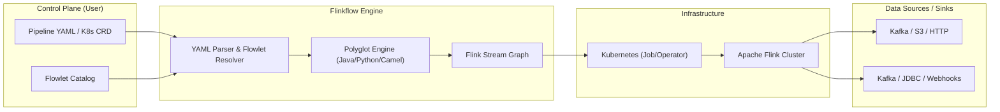

# Flinkflow

**Flinkflow** is a declarative, low-code data streaming platform built on top of Apache Flink. Inspired by Apache Camel K, it democratizes stateful stream processing by abstracting the complexities of the Flink API into a simple, Kubernetes-native YAML DSL.

---

## 🚀 The Philosophy: Democratizing Data Engineering

Traditionally, building real-time data pipelines is a specialized engineering endeavor, requiring deep Java/Scala expertise and resulting in siloed data teams. Flinkflow breaks down this "Flink Complexity Gap" by shifting the focus from **infrastructure plumbing** to **data logic**.

Our mission is to be the **"Glue Layer"** for real-time event-driven architectures—empowering Data Analysts, DevOps, and Backend Developers to build, deploy, and scale enterprise-grade streaming workloads without ever touching a Maven assembly.

### Why Flinkflow?

| Feature | Native Flink | Flinkflow |
| :--- | :--- | :--- |
| **Authoring** | Heavy Java/Maven Boilerplate | Declarative YAML DSL |
| **Development Cycle** | Compile → Package → Deploy JAR | Instant Hot-Reload (YAML/Java/Python/Camel/SQL Snippets) |
| **Logic Changes** | ~10 minute CI/CD cycles | Seconds (Apply K8s CRD or YAML) |
| **Polyglot Runtimes** | Java/Python only | **Java** (Janino), **Python** (GraalVM), **Apache Camel** (Simple/JsonPath/YAML DSL), **Apache Flink SQL** |
| **Target Persona** | Specialized Flink Engineers | Data Scientists, Analysts, DevOps, Backend Devs, Integration Devs |
| **Component Model** | Custom Code / Classes | Reusable, Parameterized **Flowlets** |

---

## ✨ Features

- **Declarative YAML DSL**: Define entire pipeline structures—Sources, Sinks, and Operations—in clean YAML.
- **Polyglot Logic Snippets**: Inject custom logic directly into your YAML—support for **Java (Janino)**, **Python (GraalVM)**, and **Apache Camel (YAML DSL/Simple)** for transformations, filters, and flatmaps without recompiling.
- **Enterprise Integration Patterns (EIP)**: Build complex routing, throttling, and field extractions using the high-performance **Apache Camel** engine.
- **Kubernetes-Native (GitOps)**: Manage pipelines as `Pipeline` and `Flowlet` Custom Resources. Fully compatible with Helm, ArgoCD, and the Flink Kubernetes Operator.
- **Reusable Flowlet Catalog**: Drag-and-drop capability for complex connectors (Kafka, Confluent, S3, JDBC) using parameterized components.
- **Advanced Data Mapping**: Support for XSLT 3.0 via Saxon-HE for structural JSON/XML transformations (Kaoto integration).
- **Observability Built-in**: Real-time monitoring of job health and throughput via a dedicated dashboard.
- **Extensible Connectors**: Unified support for Kafka, S3, JDBC, HTTP Sinks, and more.
- **Enterprise Security**: Native support for Kubernetes Secrets (`secret:name/key`) to secure credentials without hardcoding.
- **Schema Management**: First-class integration with Confluent/Apicurio Schema Registry for Avro-encoded streams with automatic schema fetching.
- **Declarative Machine Learning (Flink ML)**: Embed Flink ML Estimators and Transformers (like VectorAssembler, MinMaxScaler, KMeans, etc.) directly in pipeline YAMLs via the `type: ml` step, combining low-code streaming with native ML execution.
- **SQL/Table API Bridge**: Write ANSI SQL queries as pipeline steps with `type: sql`. Supports multi-source JOINs, windowed aggregations, event-time watermarks, and changelog output — all declared in YAML with automatic schema mapping. *(See: [SQL & ML Guide](/docs/11_SQL_AND_ML))*

---

## 🏢 Flinkflow Enterprise Edition & Services

Flinkflow is maintained by **[Talweg](https://talweg.ai)**. While the core engine is free and open-source, we offer professional services and an enterprise-grade distribution for organization-wide streaming platforms.

| Feature | Flinkflow Community Edition | Flinkflow Enterprise Edition |
| :--- | :---: | :---: |
| **Core DSL & Polyglot Runtimes** | ✅ | ✅ |
| **Agentic Bridge (LLM Integration)** | ✅ | ✅ |
| **Kafka, S3, JDBC Connectors** | ✅ | ✅ |
| **Declarative Flink ML (Estimators/Transformers)** | ✅ | ✅ |
| **SQL / Table API Bridge** | ✅ | ✅ |
| **GPU-Accelerated Inference (ONNX/TensorFlow)** | ❌ | ✅ |
| **AI-Powered Validation Assist** | ❌ | ✅ |
| **Live Hot-Reloading** | ❌ | ✅ |
| **Enterprise RBAC & SSO** | ❌ | ✅ |
| **Data Security (Format-Preserved Encryption)** | ❌ | ✅ |
| **Air-Gapped Container Gallery** | ❌ | ✅ |
| **Advanced Observability (SLA/Audit)** | ❌ | ✅ |
| **Proprietary High-Perf Connectors** | ❌ | ✅ |
| **Day 1 Setup Support (Kubernetes)** | ❌ | ✅ |
| **Professional Services** | ❌ | ✅ |

### 🛠️ Professional Services
Talweg provides expert consulting and managed services to accelerate your streaming journey:
- **Pipeline Architecture Reviews**: Expert validation of your DAGs, stateful logic, and secret management.
- **End-to-End Pipeline Development**: Full-lifecycle implementation support, from data source ingestion to final sink delivery.
- **Custom Flowlet Development**: Building proprietary, secure connectors for your internal systems (SAP, AS/400, etc.).
- **Agentic AI & ML Strategy**: Real-time inference optimization and agentic workflow design.
- **Managed Hosting**: Fully managed, auto-scaling container based Flinkflow clusters on AWS, Azure, GCP, or On-Premise.

**Need help or looking for enterprise features?** [Contact our team](mailto:contact@talweg.ai) or visit **[talweg.ai](https://talweg.ai)**.

---

## 🗺️ Visual Overview

Flinkflow bridges the gap between declarative configuration and high-performance execution.

