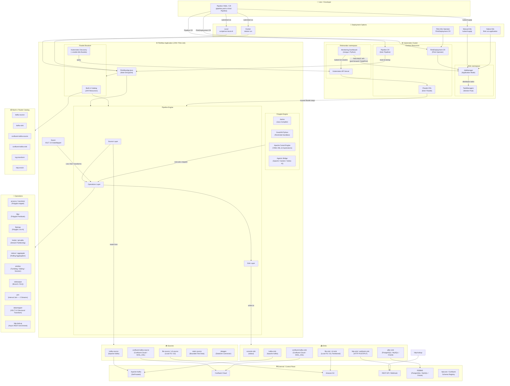
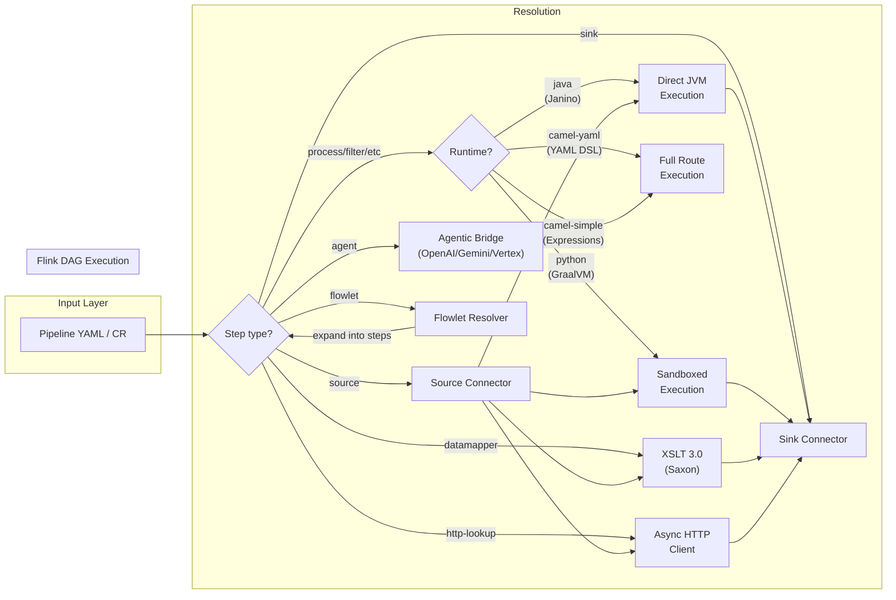
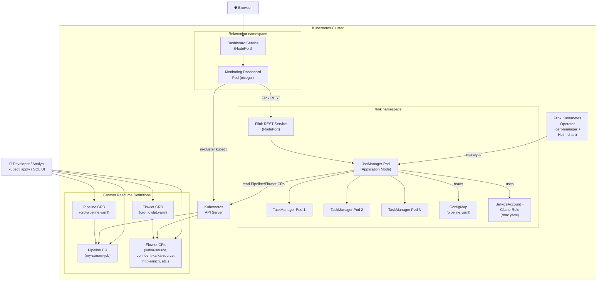
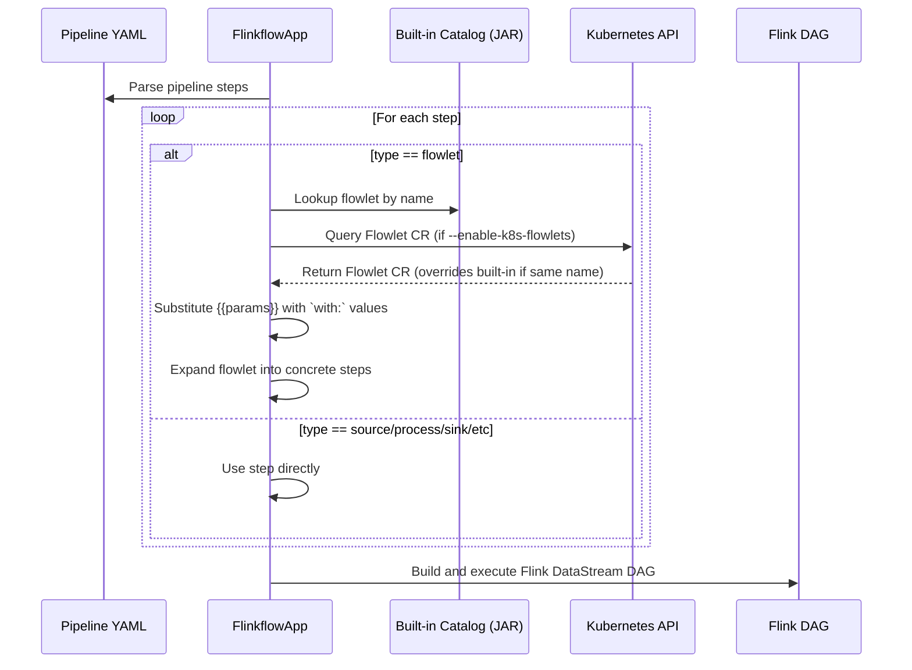

# Flinkflow — System Architecture Diagram

## Full System Overview

---

## Pipeline Step Flow

---

## Kubernetes Deployment Architecture

---

## Flowlet Resolution Flow

---

## Polyglot & Security Architecture

Flinkflow separates pipeline structure (YAML) from custom business logic (Java/Python/Camel/Agent).

### Execution Engines
- **Janino Engine**: High-performance Java compilation at runtime. Snippets are compiled directly into Flink `RichMapFunction`, `RichFilterFunction`, etc., and execute at native JVM speeds.
- **GraalVM Python Engine**: Advanced polyglot execution. Python snippets are executed within a **Restricted Sandbox** provided by the GraalVM Context API.
- **Apache Camel Engine**: Declarative expression and route evaluation.
    - **Expressions**: Supports **Simple**, **JsonPath**, and **Groovy** for data-centric transformations.
    - **YAML DSL**: Supports full **Camel YAML DSL** fragments, enabling complex EIPs (Choice, Throttler, Unmarshal) within a single Flink operator.
- **Agentic Bridge** (`language: agent`): Runs autonomous LLM-backed AI agents directly inside a Flink `ProcessFunction`. Supports multi-turn stateful memory (Flink `ValueState`), Flowlet-as-a-Tool execution, and multiple providers:
    - **OpenAI**: `gpt-4o`, `gpt-4`, `o1-*`, `o3-*` — requires `OPENAI_API_KEY`
    - **Google Gemini (AI Studio)**: `gemini-*` — requires `GOOGLE_API_KEY`
    - **Google Vertex AI**: Any Gemini model with `provider: vertex` — uses Application Default Credentials (ADC)

### Security Sandboxing (Zero-Trust)

Flinkflow implements a strict, **deny-by-default** security model for guest code execution to protect the Flink JobManager and TaskManagers from potential exploits within user-supplied YAML logic.

#### Python Sandbox Protections (GraalVM)

The Python execution environment ([PythonEvaluator.java](../src/main/java/ai/talweg/flinkflow/core/PythonEvaluator.java)) is configured with a zero-trust policy:

- **Blocked File System Access**: `IOAccess.NONE` is enforced. Guest scripts cannot read from or write to the host disk (it cannot access secrets, `/etc/hosts`, or log files).
- **Blocked Java Class Lookup**: Scripts are prohibited from using `import java` or looking up arbitrary Java classes. This prevents scripts from calling `java.lang.System.exit()` or accessing internal JVM state.
- **Blocked Native Access**: Loading native libraries or executing external binaries is strictly prohibited.
- **Blocked Multi-Threading**: Scripts cannot spawn new host threads or background processes.
- **Blocked Polyglot Interop**: Python logic cannot access or execute other guest languages.
- **Scoped Host Access**: Guest code can only interact with host objects that are explicitly passed as arguments by the Flinkflow engine.

#### Java Logic Validation (Janino)

Java code snippets are dynamically compiled into isolated functional blocks. By default, they do not share broad access to the Flinkflow application's internal classes, ensuring that custom business logic remains bounded by the pipeline context.

