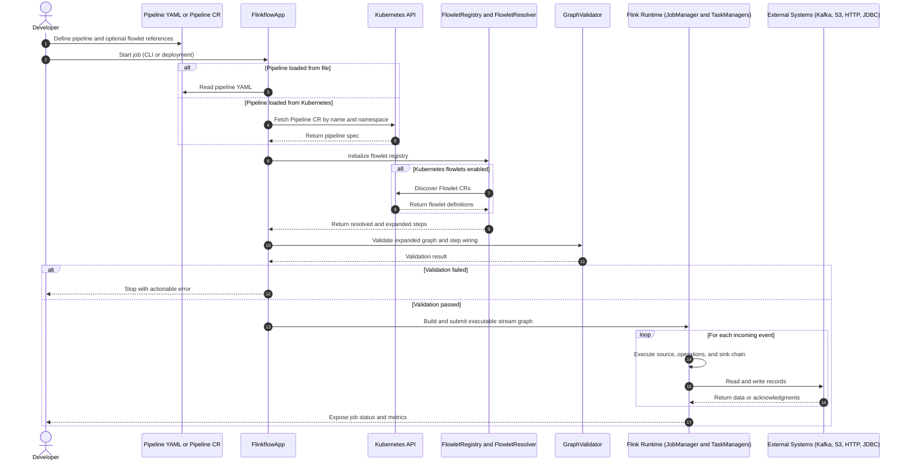
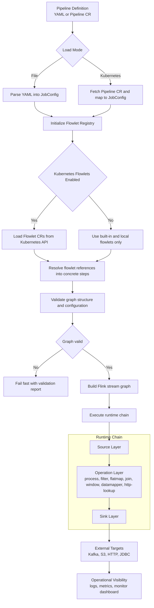

# Flinkflow End-to-End Architecture Sequence and Flow

## End-to-End Sequence

## End-to-End Runtime Flow

## Reading Guide

- The sequence diagram explains call order and decision points from submission to live processing.
- The flow diagram explains transformation stages and branching logic in the runtime lifecycle.
- Together they document both control-plane behavior (loading and validation) and data-plane behavior (stream execution).
