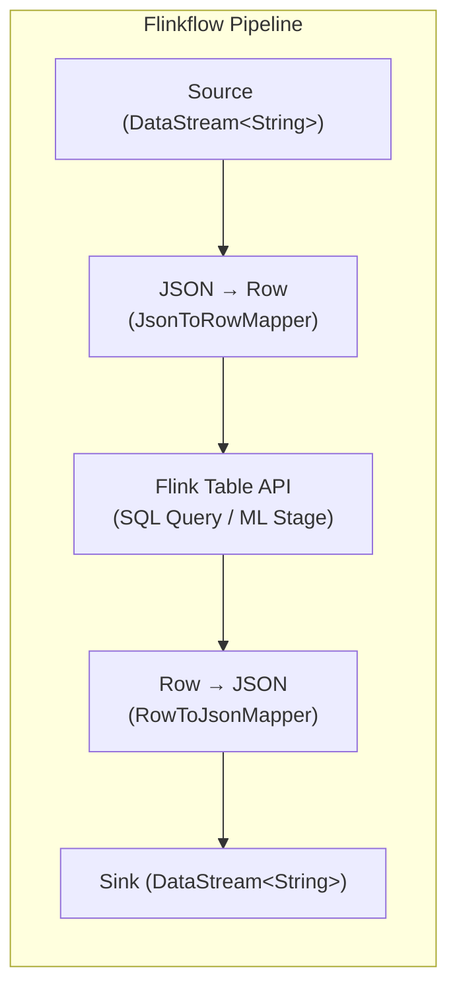
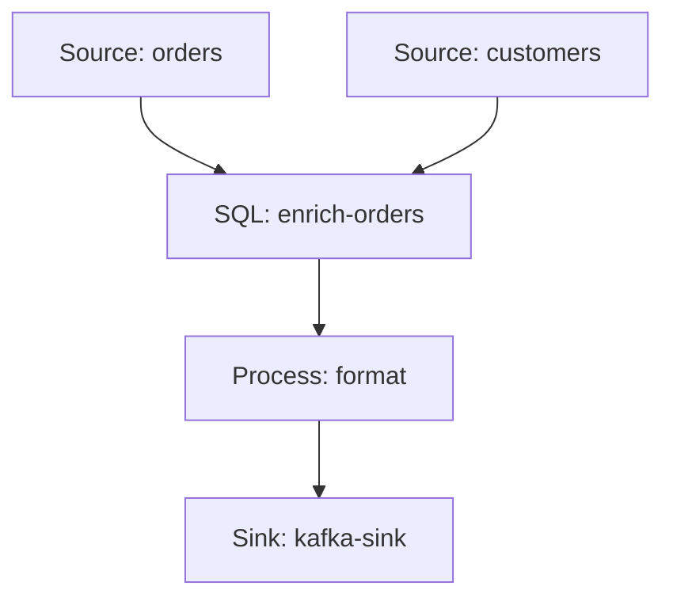

# 🧠 Flinkflow SQL & ML Bridge

Flinkflow extends its YAML DSL with two powerful step types — **`sql`** and **`ml`** — that bridge Apache Flink's Table/SQL API and Flink ML library into the declarative pipeline model. This guide explains what these features are, how to use them, and how they compare to writing native Flink SQL or Flink ML code.

---

## 📐 Architecture: The DataStream ↔ Table Bridge

Flinkflow's core data model is `DataStream<String>` — every record flowing through the pipeline is a JSON string (see [ADR-001](/docs/08_VISION#adr-001-string-typed-stream-data-model)). The SQL and ML steps work by transparently converting between this string-based model and Flink's typed `Table` / `Row` representation:



A single **shared `StreamTableEnvironment`** is created once per pipeline execution and reused across all SQL and ML steps. This enables:

- Multiple SQL steps in the same pipeline to reference each other's temporary views
- ML steps and SQL steps to coexist and share the same Table environment
- Zero boilerplate — the conversion is handled automatically based on `schema.*` properties you declare in YAML

---

## 🔍 The `sql` Step

The `sql` step lets you write standard **ANSI SQL queries** against your streaming data — directly in your pipeline YAML.

### Single-Source SQL

When a SQL step follows a single upstream source, the incoming `DataStream<String>` is automatically registered as a temporary table view:

```yaml
name: "Simple SQL Filter"
parallelism: 1
steps:
  - type: source
    name: events
    connector: kafka-source
    properties:
      bootstrap.servers: "kafka:9092"
      topic: "raw-events"

  - type: sql
    name: high-value-filter
    properties:
      schema.userId: "string"
      schema.eventType: "string"
      schema.amount: "double"
      tableName: "events"
      query: |
        SELECT userId, eventType, amount
        FROM events
        WHERE amount > 100.0
        
  - type: sink
    name: console-sink
```

**Key properties:**

| Property | Required | Description |
| :--- | :---: | :--- |
| `schema.<field>` | ✅ | Declares the field name and type for JSON → Row mapping |
| `query` | ✅ | The SQL query to execute (can also be placed in `code:`) |
| `tableName` | ❌ | Name of the temporary view (defaults to `"input"`) |
| `outputMode` | ❌ | `append`, `changelog`, or `auto` (default) |

### Multi-Source SQL (JOINs)

The real power unlocks when you need to join or combine multiple streams. Use the `inputs` list to reference multiple upstream steps by name, with **namespaced schemas**:

```yaml
name: "Order Enrichment Pipeline"
parallelism: 1
steps:
  - type: source
    name: orders
    connector: kafka-source
    properties:
      bootstrap.servers: "kafka:9092"
      topic: "orders"

  - type: source
    name: customers
    connector: kafka-source
    properties:
      bootstrap.servers: "kafka:9092"
      topic: "customers"

  - type: sql
    name: enrich-orders
    inputs: [orders, customers]
    properties:
      # Namespaced schemas: schema.<tableName>.<field>
      schema.orders.orderId: "string"
      schema.orders.customerId: "string"
      schema.orders.amount: "double"
      schema.orders.orderTime: "timestamp"

      schema.customers.customerId: "string"
      schema.customers.name: "string"
      schema.customers.level: "string"

      query: |
        SELECT
          o.orderId,
          c.name AS customer_name,
          c.level AS customer_level,
          o.amount
        FROM orders o
        JOIN customers c ON o.customerId = c.customerId

  - type: sink
    name: console-sink
```

> [!IMPORTANT]
> When using `inputs`, every input stream name **must** have a matching set of `schema.<tableName>.<field>` entries. The engine validates this at startup and will fail fast with a clear error message if any input is missing its schema.

### Supported Schema Types

The `schema.*` property values map to Flink type system types:

| YAML Type | Flink TypeInformation | Example |
| :--- | :--- | :--- |
| `string` | `Types.STRING` | `schema.name: "string"` |
| `int` / `integer` | `Types.INT` | `schema.age: "int"` |
| `long` | `Types.LONG` | `schema.timestamp: "long"` |
| `double` / `float` | `Types.DOUBLE` | `schema.price: "double"` |
| `boolean` | `Types.BOOLEAN` | `schema.active: "boolean"` |
| `timestamp` | `Types.LOCAL_DATE_TIME` | `schema.eventTime: "timestamp"` |
| `date` | `Types.LOCAL_DATE` | `schema.birthDate: "date"` |
| `decimal` | `Types.BIG_DEC` | `schema.revenue: "decimal"` |
| `vector` | `VectorTypeInfo.INSTANCE` | `schema.features: "vector"` |
| `array<T>` | `Types.LIST(T)` | `schema.tags: "array<string>"` |
| `map<K,V>` | `Types.MAP(K, V)` | `schema.meta: "map<string,string>"` |

### Event-Time & Watermarks

For windowed SQL queries (e.g., `TUMBLE`, `HOP`), you can configure event-time watermarks:

```yaml
  - type: sql
    name: windowed-agg
    properties:
      schema.sensorId: "string"
      schema.temperature: "double"
      schema.eventTime: "timestamp"
      
      # Watermark configuration
      watermark.column: "eventTime"
      watermark.delay: "5000"     # 5 seconds of allowed out-of-orderness
      
      tableName: "readings"
      query: |
        SELECT
          sensorId,
          TUMBLE_START(eventTime, INTERVAL '1' MINUTE) AS window_start,
          AVG(temperature) AS avg_temp
        FROM readings
        GROUP BY sensorId, TUMBLE(eventTime, INTERVAL '1' MINUTE)
```

For multi-source pipelines, watermarks are namespaced per input:

```yaml
      watermark.orders.column: "orderTime"
      watermark.orders.delay: "3000"
```

### Output Modes

The `outputMode` property controls how the SQL result table is converted back to a `DataStream<String>`:

| Mode | Behaviour | Use When |
| :--- | :--- | :--- |
| `append` | Uses `tEnv.toDataStream()` — only insert rows | Simple filters, projections, non-aggregating JOINs |
| `changelog` | Uses `tEnv.toChangelogStream()` — includes `_op` field (`+I`, `-D`, `+U`, `-U`) | Aggregations, GROUP BY, windowed queries |
| `auto` (default) | Tries `append` first; falls back to `changelog` on `TableException` | Most use cases — let the engine decide |

**Example changelog output:**
```json
{"_op": "+I", "sensorId": "s-01", "window_start": "2026-06-13T12:00", "avg_temp": 23.5}
{"_op": "-U", "sensorId": "s-01", "window_start": "2026-06-13T12:00", "avg_temp": 23.5}
{"_op": "+U", "sensorId": "s-01", "window_start": "2026-06-13T12:00", "avg_temp": 24.1}
```

---

## 🤖 The `ml` Step

The `ml` step embeds native **Apache Flink ML** stages (Estimators and Transformers) directly in your pipeline YAML. No Java code, no Maven dependencies — just declare the algorithm and its parameters.

### Basic Usage

```yaml
name: "Feature Engineering Pipeline"
parallelism: 1
steps:
  - type: source
    name: sensor-data
    connector: kafka-source
    properties:
      bootstrap.servers: "kafka:9092"
      topic: "sensor-readings"

  - type: ml
    name: assemble-features
    properties:
      algorithm: "VectorAssembler"
      inputCols: "temperature,humidity,pressure"
      outputCol: "features"
      schema.temperature: "double"
      schema.humidity: "double"
      schema.pressure: "double"

  - type: ml
    name: normalize
    properties:
      algorithm: "MinMaxScaler"
      inputCol: "features"
      outputCol: "scaledFeatures"
      schema.temperature: "double"
      schema.humidity: "double"
      schema.pressure: "double"
      schema.features: "vector"

  - type: sink
    name: console-sink
```

### How It Works

1. **JSON → Row**: The incoming `DataStream<String>` is mapped to `DataStream<Row>` using the `schema.*` definitions
2. **Row → Table**: The Row stream is converted to a Flink `Table` via `StreamTableEnvironment`
3. **ML Stage Execution**: The algorithm is dynamically instantiated using `MLStageFactory` and configured via reflection:
   - **Transformer** (e.g., `VectorAssembler`): Calls `.transform(inputTable)` directly
   - **Estimator** (e.g., `MinMaxScaler`, `KMeans`): Calls `.fit(inputTable)` to train, then `.transform(inputTable)` to apply the model
4. **Table → JSON**: The output Table is converted back to `DataStream<String>` as JSON

### Supported Algorithms (Short Names)

You can use short names or fully-qualified class names:

| Short Name | Full Class | Type |
| :--- | :--- | :--- |
| `VectorAssembler` | `o.a.f.ml.feature.vectorassembler.VectorAssembler` | Transformer |
| `MinMaxScaler` | `o.a.f.ml.feature.minmaxscaler.MinMaxScaler` | Estimator |
| `MinMaxScalerModel` | `o.a.f.ml.feature.minmaxscaler.MinMaxScalerModel` | Transformer |
| `KMeans` | `o.a.f.ml.clustering.kmeans.KMeans` | Estimator |
| `KMeansModel` | `o.a.f.ml.clustering.kmeans.KMeansModel` | Transformer |
| `LogisticRegression` | `o.a.f.ml.classification.logisticregression.LogisticRegression` | Estimator |
| `LogisticRegressionModel` | `o.a.f.ml.classification.logisticregression.LogisticRegressionModel` | Transformer |

> [!TIP]
> Any Flink ML stage not in the short-name table can still be used — just specify the **fully-qualified Java class name** as the `algorithm` value.

### Loading Pre-Trained Models

Use the `modelPath` property to load a previously saved model instead of training from scratch:

```yaml
  - type: ml
    name: predict
    properties:
      algorithm: "KMeansModel"
      modelPath: "s3://models/kmeans-v2"
      schema.features: "vector"
```

### Property Mapping

All properties (except `algorithm`, `modelPath`, and `schema.*`) are mapped to the ML stage's setter methods using reflection. For example, `inputCol: "features"` calls `stage.setInputCol("features")`. Supported parameter types include: `String`, `String[]`, `int`, `double`, `boolean`, `long`, `float`, and `Vector`.

---

## ⚖️ How Flinkflow SQL/ML Differs From Native Flink

### vs. Native Flink SQL / Table API

| Aspect | Native Flink SQL | Flinkflow SQL Step |
| :--- | :--- | :--- |
| **Language** | Java/Scala application code | Declarative YAML + inline SQL |
| **Setup** | Maven project, `StreamTableEnvironment` boilerplate, `TypeInformation` wiring | Zero boilerplate — `schema.*` properties handle all type mapping |
| **Schema Declaration** | Programmatic `Schema.newBuilder().column(...)` chains | Flat key-value pairs: `schema.field: "type"` |
| **Multi-Table JOINs** | Manually register each `DataStream` as a view, manage `TypeInformation` for each | Declare `inputs: [a, b]` and namespaced schemas — the engine handles registration |
| **Watermarks** | `WatermarkStrategy.forBoundedOutOfOrderness(...)` code | `watermark.column` / `watermark.delay` properties |
| **Output Handling** | Manual `toDataStream()` vs `toChangelogStream()` decision + serialization | Automatic via `outputMode: auto` with built-in JSON serialization |
| **Deployment** | Compile → package JAR → deploy | Apply YAML — hot-reloadable in Kubernetes |
| **Integration** | Standalone Table API program | Composable with all other Flinkflow steps (filters, process, ML, Camel, etc.) |

#### What You Get For Free

With Flinkflow's SQL step, the engine handles all of the following automatically:

- ✅ Creating and sharing the `StreamTableEnvironment`
- ✅ Parsing JSON strings into typed `Row` objects
- ✅ Registering `DataStream`s as temporary SQL views
- ✅ Resolving Flink `TypeInformation` from simple type strings
- ✅ Assigning watermarks for event-time processing
- ✅ Converting SQL result tables back to JSON strings
- ✅ Handling changelog semantics (retractions/updates) transparently

#### What You Give Up

Flinkflow's SQL step is designed for the **80% use case**. For advanced scenarios, you may still need native Flink code:

- ❌ Custom `TypeSerializer` implementations
- ❌ Complex stateful processing that mixes Table API with ProcessFunction state
- ❌ Dynamic table DDL (CREATE TABLE, CREATE CATALOG) — Flinkflow registers views, not full catalog tables
- ❌ Flink SQL connectors (e.g., `CREATE TABLE ... WITH ('connector' = 'kafka')`) — Flinkflow uses its own connector model

> [!NOTE]
> Flinkflow SQL is **not** a replacement for the Flink SQL CLI or Flink SQL Gateway. It is a **bridge** that lets you use SQL as a transformation step within a broader declarative pipeline — alongside filters, code snippets, ML stages, and Camel integrations.

---

### vs. Native Flink ML

| Aspect | Native Flink ML | Flinkflow ML Step |
| :--- | :--- | :--- |
| **Language** | Java application code | Declarative YAML |
| **Stage Instantiation** | `new MinMaxScaler().setInputCol(...).setOutputCol(...)` | `algorithm: "MinMaxScaler"` + properties auto-mapped via reflection |
| **Schema Handling** | Manual `DataStream<Row>` construction with `TypeInformation` | `schema.*` properties — same as SQL step |
| **Pipeline Composition** | `Pipeline.of(stage1, stage2).fit(table)` | Sequential `ml` steps in YAML |
| **Model Persistence** | `model.save(path)` / `Model.load(env, path)` in code | `modelPath` property to load pre-trained models |
| **Integration** | Standalone ML program | Composable with sources, SQL, filters, sinks — all in one YAML |

#### Key Difference: The StreamTableEnvironment Bridge

In native Flink ML, you must manually:

1. Create a `StreamTableEnvironment`
2. Convert your `DataStream` to a `Table` (choosing between position-based and name-based Row modes)
3. Handle ML-specific constraints (e.g., VectorAssembler requires position-based Rows)
4. Convert the output `Table` back to your target `DataStream` type

Flinkflow handles all of this automatically — including the subtle position-based vs. name-based Row compatibility issue that frequently trips up developers working with `VectorAssembler` and similar stages.

---

## 🔗 Combining SQL and ML

Because both `sql` and `ml` steps share the same `StreamTableEnvironment`, you can chain them naturally:

```yaml
name: "Feature Engineering + SQL Analytics"
parallelism: 1
steps:
  - type: source
    name: sensor-data
    connector: kafka-source
    properties:
      bootstrap.servers: "kafka:9092"
      topic: "sensors"

  # Step 1: Assemble raw fields into a feature vector
  - type: ml
    name: assemble
    properties:
      algorithm: "VectorAssembler"
      inputCols: "temperature,humidity"
      outputCol: "features"
      schema.sensorId: "string"
      schema.temperature: "double"
      schema.humidity: "double"

  # Step 2: Normalize the feature vector
  - type: ml
    name: scale
    properties:
      algorithm: "MinMaxScaler"
      inputCol: "features"
      outputCol: "scaledFeatures"
      schema.sensorId: "string"
      schema.temperature: "double"
      schema.humidity: "double"
      schema.features: "vector"

  # Step 3: Use SQL to filter and aggregate the results
  - type: sql
    name: analyze
    properties:
      schema.sensorId: "string"
      schema.temperature: "double"
      schema.humidity: "double"
      schema.features: "vector"
      schema.scaledFeatures: "vector"
      tableName: "enriched"
      query: |
        SELECT sensorId, temperature, humidity
        FROM enriched
        WHERE temperature > 30.0

  - type: sink
    name: console-sink
```

---

## 🧩 DAG Topology Support

Flinkflow pipelines are **directed acyclic graphs (DAGs)**, not just linear chains. The `inputs` property on any step allows you to reference multiple upstream steps, enabling fan-in topologies:



The `GraphValidator` ensures at pipeline validation time that:
- Every step referenced in `inputs` exists and is defined **before** the referencing step
- No circular dependencies exist
- All input schemas are fully specified

---

## 📚 Further Reading

| Resource | Description |
| :--- | :--- |
| [User Guide](/docs/02_USER_GUIDE) | Core Flinkflow concepts and quick start |
| [Configuration Reference](/docs/04_GUIDE_CONFIGURATION) | Full DSL spec for all connectors and properties |
| [Architecture](/docs/01_ARCHITECTURE) | How the engine works under the hood |
| [Vision & Roadmap](/docs/08_VISION) | Strategic direction and upcoming features |
| [Apache Flink SQL Docs](https://nightlies.apache.org/flink/flink-docs-stable/docs/dev/table/sql/overview/) | Official Flink SQL reference |
| [Apache Flink ML Docs](https://nightlies.apache.org/flink/flink-ml-docs-stable/) | Official Flink ML reference |

---

*Questions or feedback? Connect with us on [Zulip](https://talweg.zulipchat.com) or [open an issue](https://github.com/talwegai/flinkflow/issues).*
