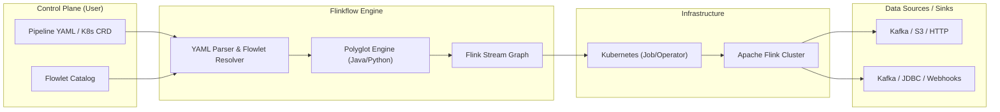

# Flinkflow

**Flinkflow** is a declarative, low-code data streaming platform built on top of Apache Flink. Inspired by Apache Camel K, it democratizes stateful stream processing by abstracting the complexities of the Flink API into a simple, Kubernetes-native YAML DSL.

---

## 🚀 The Philosophy: Democratizing Data Engineering

Traditionally, building real-time data pipelines is a specialized engineering endeavor, requiring deep Java/Scala expertise and resulting in siloed data teams. Flinkflow breaks down this "Flink Complexity Gap" by shifting the focus from **infrastructure plumbing** to **data logic**.

Our mission is to be the **"Glue Layer"** for real-time event-driven architectures—empowering Data Analysts, DevOps, and Backend Developers to build, deploy, and scale enterprise-grade streaming workloads without ever touching a Maven assembly.

### Why Flinkflow?

| Feature | Native Java Flink | Flinkflow |
| :--- | :--- | :--- |
| **Authoring** | Heavy Java/Maven Boilerplate | Declarative YAML DSL |
| **Development Cycle** | Compile → Package → Deploy JAR | Instant Hot-Reload (YAML/Java/Python Snippets) |
| **Logic Changes** | ~10 minute CI/CD cycles | Seconds (Apply K8s CRD or YAML) |
| **Target Persona** | Specialized Flink Engineers | Data Scientists, Analysts, DevOps, Backend Devs |
| **Component Model** | Custom Code / Classes | Reusable, Parameterized **Flowlets** |

---

## ✨ Features

- **Declarative YAML DSL**: Define entire pipeline structures—Sources, Sinks, and Operations—in clean YAML.
- **Polyglot Logic Snippets**: Inject custom logic directly into your YAML—support for both **Java (Janino)** and **Python (GraalVM)** for transformations, filters, and flatmaps without recompiling.
- **Kubernetes-Native (GitOps)**: Manage pipelines as `Pipeline` and `Flowlet` Custom Resources. Fully compatible with Helm, ArgoCD, and the Flink Kubernetes Operator.
- **Reusable Flowlet Catalog**: Drag-and-drop capability for complex connectors (Kafka, Confluent, S3, JDBC) using parameterized components.
- **Advanced Data Mapping**: Support for XSLT 3.0 via Saxon-HE for structural JSON/XML transformations (Kaoto integration).
- **Observability Built-in**: Real-time monitoring of job health and throughput via a dedicated dashboard.
- **Extensible Connectors**: Unified support for Kafka, S3, JDBC, HTTP Sinks, and more.
- **Enterprise Security**: Native support for Kubernetes Secrets (`secret:name/key`) to secure credentials without hardcoding.
- **Schema Management**: First-class integration with Confluent/Apicurio Schema Registry for Avro-encoded streams with automatic schema fetching.

---

## 🗺️ Visual Overview

Flinkflow bridges the gap between declarative configuration and high-performance execution.

